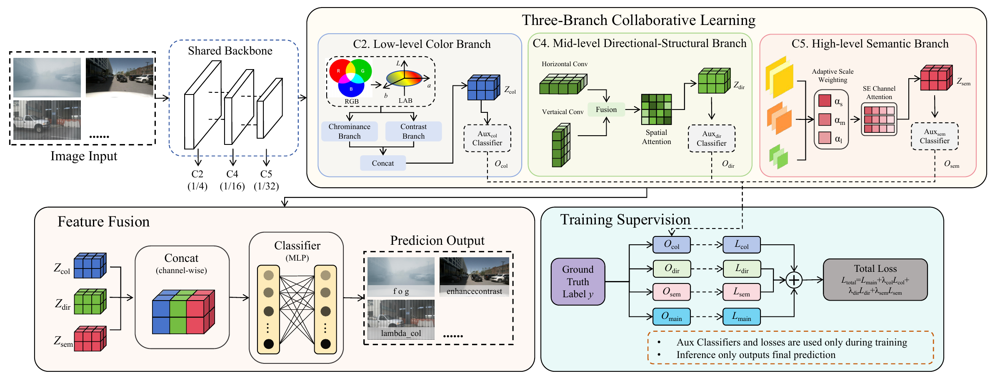
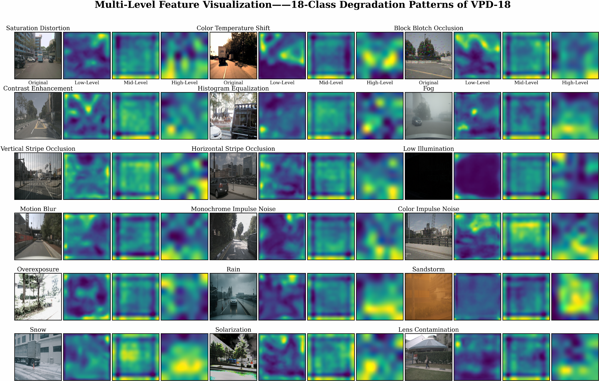

<div align="center">

# PDP-Net

### Perception Degradation Patterns Identification<br>for Visual Perception System in Autonomous Driving

**Multi-level collaborative learning for visual perception degradation identification**

[](#installation)
[](https://drive.google.com/drive/folders/REPLACE_WITH_VPD18_FOLDER_ID)
[](#vpd-18-dataset)

[Paper](https://example.com/pdp-net/paper) · [Dataset](https://drive.google.com/drive/folders/REPLACE_WITH_VPD18_FOLDER_ID) · [Training](docs/USAGE.md) · [中文](README.zh-CN.md)

</div>

<!-- Maintainer: example resource URLs are centralized in links.json for replacement. -->

This repository provides the PyTorch implementation of **PDP-Net** and the data preparation tools for **VPD-18**. We study fine-grained identification of visual perception degradation in autonomous driving, covering hardware faults, hardware degradation, software faults, and environmental interference.

## Overview

<p align="center">
  <a href="assets/architecture.pdf"></a>
</p>

PDP-Net combines three complementary representations in a shared-backbone framework:

- **Color and contrast.** Explicit LAB modeling captures chrominance, illumination, and local contrast variations.
- **Directional structure.** Horizontal and vertical convolutions with spatial attention capture stripes, directional artifacts, and structural abnormalities.
- **Global semantics.** Adaptive multi-scale context modeling captures visibility degradation and reduced semantic discriminability.

The branch features are concatenated for final classification. Auxiliary supervision encourages each branch to learn discriminative features during training.

## VPD-18 dataset

<p align="center">
  <a href="assets/dataset_visualization.pdf"></a>
</p>

**Visualizing VPD-18.** Each example shows a degraded input image followed by its low-, mid-, and high-level feature maps. The figure covers all 18 degradation patterns. [View PDF](assets/dataset_visualization.pdf).

**102,372 images · 18 degradation patterns · 6 groups**

VPD-18 spans contrast/color, obstruction, noise, motion, abnormal lighting, and adverse weather. Dataset statistics below follow Table I of the paper.

| Group | Patterns | Images |
| :--- | ---: | ---: |
| Contrast / Color | 5 | 33,990 |
| Obstruction | 4 | 27,192 |
| Noise | 2 | 13,596 |
| Motion | 1 | 6,798 |
| Abnormal Lighting | 2 | 13,596 |
| Adverse Weather | 4 | 7,200 |
| **Total** | **18** | **102,372** |

**[Download VPD-18 from Google Drive](https://drive.google.com/drive/folders/REPLACE_WITH_VPD18_FOLDER_ID)**

See [data preparation](data/README.md) for the full taxonomy and the training directory format. The image archive is distributed separately from the code.

## Main results

Selected comparisons on VPD-18, reported in Table II of the paper:

| Method | Accuracy (%) | F1 (%) | Precision (%) | Recall (%) |
| :--- | ---: | ---: | ---: | ---: |
| ResNet-50 | 94.80 | 94.78 | 96.20 | 95.10 |
| MobileNetV3 | 95.84 | 95.88 | 96.12 | 95.85 |
| ViT-Small | 96.32 | 96.23 | 96.77 | 96.27 |
| EfficientNet-B0 | 96.73 | 96.74 | 96.73 | 96.53 |
| AlexNet | 96.81 | 95.73 | 97.10 | 96.75 |
| Swin-T | 97.39 | 97.39 | 97.24 | 97.20 |
| CoAtNet-0 | 97.51 | 97.51 | 97.45 | 97.35 |
| **PDP-Net (Ours)** | **98.46** | **97.87** | **98.10** | **97.81** |

| Model | Backbone | Parameters | FLOPs | FPS |
| :--- | :--- | ---: | ---: | ---: |
| PDP-Net | ResNet-50 | 56.04 M | 16.18 G | 244.79 |

Efficiency values follow the paper's measurement setting on an NVIDIA RTX 4090D. See the paper for the complete comparison and ablation studies.

## Installation

From the repository root, install the training dependencies in your Python environment:

```bash
python -m pip install -r requirements.txt
```

The paper's experiment environment uses Python 3.8, PyTorch 2.0.0, and CUDA 11.8. See [environment and usage notes](docs/USAGE.md) for dependency details.

## Training and evaluation

Prepare images under `dataset/<class_folder>/<image>` and run:

```bash
python "PDPNet_train_model(1).py"
```

The script trains the model, selects the checkpoint with the best validation macro F1, and generates evaluation reports and visualizations in `results_multibranch/`. Configuration is defined in the script's `main()` function. See [training instructions](docs/USAGE.md#training-and-evaluation) for input paths, pretrained backbone loading, and outputs.

## Degradation generation

`main.py` provides the image degradation generation functions. Install the generation dependencies and follow the [generation guide](docs/USAGE.md#generating-degraded-images):

```bash
python -m pip install -r requirements-generation.txt
```

## Repository structure

```text
PDP-Net/
├── assets/                       # Paper framework figure
├── data/                         # Taxonomy and data preparation
├── docs/USAGE.md                  # Environment, training, and generation
├── PDPNet_train_model(1).py       # Network, training, and evaluation
├── main.py                       # Degradation generation
├── requirements.txt
└── requirements-generation.txt
```

## Reference

**Perception Degradation Patterns Identification for Visual Perception System in Autonomous Driving.** [Paper](https://example.com/pdp-net/paper).

## Acknowledgements

The implementation uses PyTorch, torchvision, and imgaug. The framework figure and reported results are from the accompanying paper.
